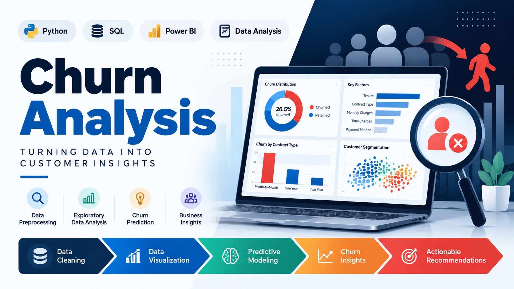

# Churn_Analysis

<p align="center">
  
</p>

# 📊 Churn Analysis and Customer Intelligence

## Overview

This project analyzes customer churn data using **Python** and **SQL** to identify factors influencing customer retention and business performance. The project follows a complete data analytics workflow, including data extraction from a SQL database, data cleaning, feature engineering, exploratory data analysis (EDA), visualization, business insights, and presentation of results through a report and PowerPoint.

The goal is to transform raw customer data into meaningful insights that help organizations improve customer retention and make data-driven decisions.

---

# Dataset

* **Source:** SQLite Database (`customer_churn.db`)
* **Domain:** Customer Churn Analysis
* **Data Loaded Using:** SQL + Python
* **Primary Tables:**

  * Customer
  * Subscription
  * Transaction (and related tables)

---

# Tools & Technologies

* Python
* SQL (SQLite)
* Pandas
* NumPy
* Matplotlib
* Seaborn
* Jupyter Notebook
* PowerPoint
* Microsoft Word / PDF

---

# Project Workflow

## 1. Data Loading

* Connected Python with SQLite database.
* Imported SQL tables into Pandas DataFrames.
* Explored database schema and table information.

## 2. Data Cleaning

* Renamed columns for better readability.
* Removed unnecessary columns.
* Converted data types.
* Standardized categorical values.
* Handled missing values.
* Verified data quality.

## 3. Feature Engineering

* Created new features to improve analysis.
* Merged multiple SQL tables using joins.
* Prepared a final analytical dataset.

## 4. Exploratory Data Analysis (EDA)

* Analyzed customer demographics.
* Explored subscription and transaction behavior.
* Generated descriptive statistics.
* Identified trends, patterns, and outliers.

## 5. Data Visualization

Visualizations were created using **Matplotlib** and **Seaborn**, including:

* Bar Charts
* Line Charts
* Histograms
* Box Plots
* Count Plots
* Heatmaps
* Scatter Plots

## 6. Pivot Table Analysis

* Built pivot tables to summarize customer and business metrics.
* Compared different customer segments.

## 7. Business Insights

Extracted meaningful insights to understand:

* Customer churn patterns
* Customer behavior
* Subscription trends
* Business performance indicators
* Opportunities to improve customer retention

---

# Dashboard & Presentation

The final project deliverables include:

* Analytical Report
* PowerPoint Presentation
* Visualizations
* Business Recommendations

These deliverables communicate findings in a clear, business-friendly format suitable for stakeholders.

---

# Key Results

* Successfully imported and analyzed SQL data using Python.
* Cleaned and transformed raw customer data into an analysis-ready dataset.
* Performed comprehensive exploratory data analysis.
* Created professional visualizations for better interpretation.
* Generated actionable business insights related to customer churn.
* Presented findings through a structured report and presentation.

---

# Project Structure

```text
Churn-Analysis/
│
├── data/
│   └── customer_churn.db
│
├── notebooks/
│   └── Churn-Analysis.ipynb
│
├── reports/
│   ├── Churn_Analysis_Report.pdf
│   └── Churn_Analysis_Presentation.pptx
│
├── images/
│   └── visualizations/
│
├── README.md
│
└── requirements.txt
```

---

# How to Run

### 1. Clone the repository

```bash
git clone https://github.com/your-username/churn-analysis.git
```

### 2. Navigate to the project directory

```bash
cd churn-analysis
```

### 3. Install required libraries

```bash
pip install -r requirements.txt
```

### 4. Ensure the SQLite database (`customer_churn.db`) is available in the project folder.

### 5. Launch Jupyter Notebook

```bash
jupyter notebook
```

### 6. Open **Churn-Analysis.ipynb** and run all cells to reproduce the complete analysis.

---

# Skills Demonstrated

* SQL Database Integration
* Python Programming
* Data Cleaning
* Feature Engineering
* Exploratory Data Analysis (EDA)
* Data Visualization
* Business Intelligence
* Data Storytelling
* Report Writing
* Presentation Development

---

# Author

**Ingale Dipak Mohan**

Aspiring Data Analyst

* **LinkedIn:** https://www.linkedin.com/in/dipak0709


